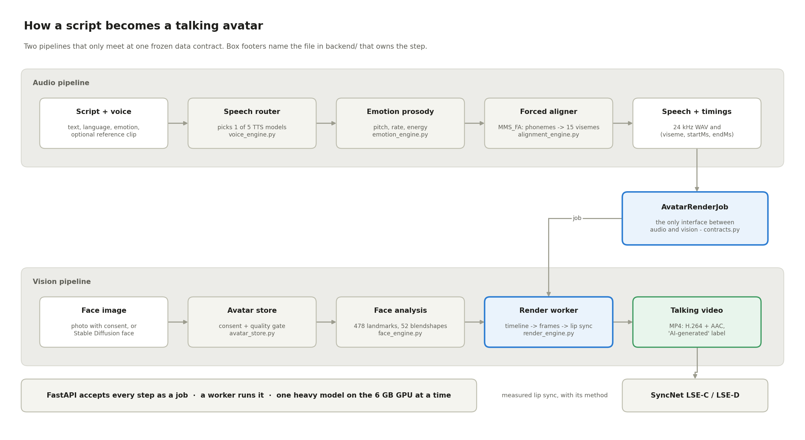
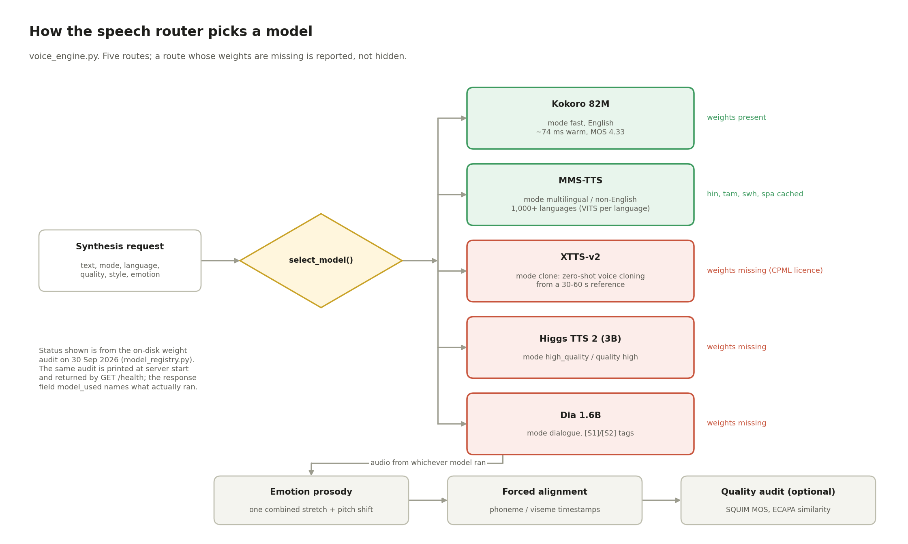
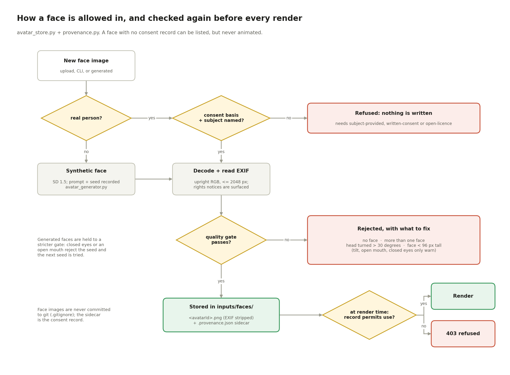
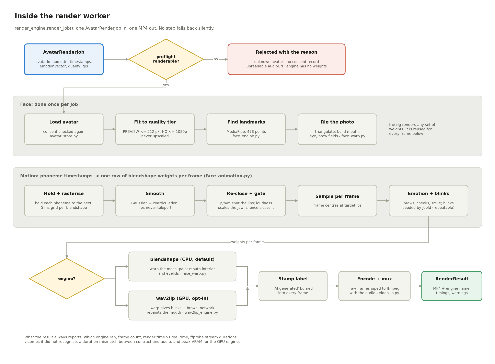
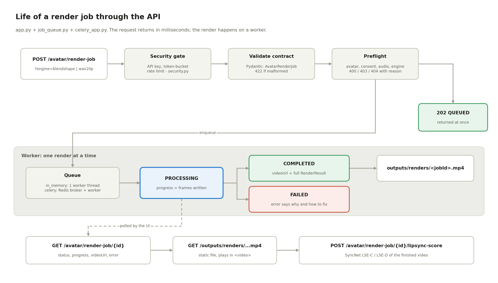
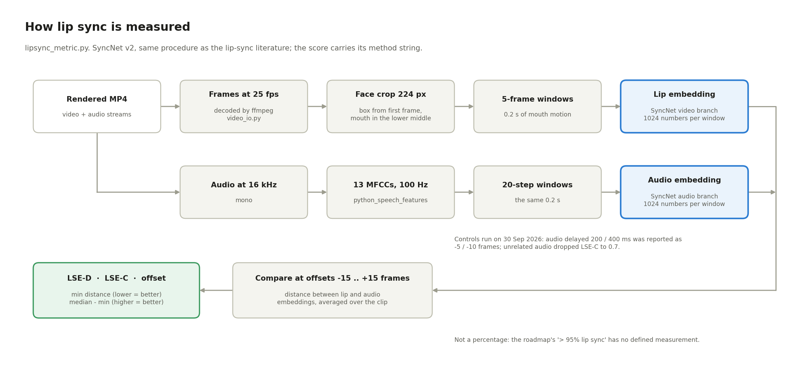

# AI Avatar Creation Platform — Project Documentation

Sep 29, 2026 · Prem Dharshan

## Executive summary

We are building an open-source platform that turns a script, a voice sample and one photo into a talking, lip-synced avatar video, using only open models that run on a single 6 GB laptop GPU.

The platform has two halves joined by one contract. The audio half turns text into speech, clones voices, and extracts millisecond timestamps of every sound. The vision half reads a face, then moves its mouth to match those timestamps.

**Where it stands (30 Sep 2026):** the first talking avatar exists. A sentence goes in and a lip-synced MP4 of a registered face comes out, by command line and through the API, with a measured sync score. It speaks with a stock voice, not a cloned one, so Integration Gate 2 is not passed yet. 446 automated tests pass. (The PDF copy of this document predates this update.)

| Area | Status | Evidence |
| --- | --- | --- |
| Text-to-speech | Working (2 of 5 models have weights) | Kokoro warm latency 73.7 ms, MOS 4.33 |
| Multilingual speech | Working | MMS-TTS benchmarked in Hindi, Tamil, Swahili, Spanish |
| Emotion control | Working | 6 presets, measured duration and loudness ratios |
| Phoneme and viseme timing | Working | Forced alignment to 15 visemes, now multilingual |
| Voice cloning | Wired, never run | XTTS-v2 weights not yet downloaded |
| Face analysis | Working, in the API | 478 landmarks, 52 blendshapes; quality gate rejects unusable photos |
| Avatar faces | Working | Consent-enforcing store; synthetic faces from Stable Diffusion 1.5 |
| Lip-synced video | Working (CPU blendshape engine) | SyncNet LSE-C: English 2.8, Hindi 4.7, Tamil 6.8 (real video is about 6 to 8); offset 0 frames |
| Neural lip sync (Wav2Lip) | Integrated, not run | Checkpoint is non-commercial; a person must opt in |

**The one thing to do next:** give the avatar a cloned voice (XTTS-v2 weights and a consented reference), which is what Gate 2 still needs, and decide whether to accept Wav2Lip's licence to raise the English sync score.

## The problem and why it matters

The hackathon asks for an AI avatar creation platform built only on open-source technology. Commercial tools (Synthesia, HeyGen, D-ID) do this well, but they are closed, priced per minute, and send your face and voice to someone else's servers.

An open alternative matters for three groups:

- **Educators** who need lessons in many languages without re-recording each one.
- **Companies** producing training and support videos that must stay on their own hardware for privacy.
- **Creators** who want a consistent presenter without being on camera every day.

### What the problem statement requires

The original problem-statement PDF in the repo is corrupted beyond recovery, and was never committed to git, so no intact copy exists here. The thresholds below survive only in our earlier notes and should be re-checked against a fresh copy of the PDF.

| Requirement | Target |
| --- | --- |
| TTS models integrated | 5 or more (Kokoro, XTTS-v2, OpenVoice V2 named) |
| Voice cloning reference | 30 to 60 seconds of audio |
| Speech quality | MOS above 3.5 |
| Cloning similarity | Above 85% |
| API response to start a job | Under 500 ms |
| API capacity | 100+ requests per minute |
| Security | Authentication and rate limiting |
| Later milestones | Lip sync, avatar generation, real-time streaming, ethical safeguards |

### The hard constraint: one laptop GPU

Everything must run on an NVIDIA RTX 4050 laptop GPU with 6 GB of memory and about 25 GB of free disk. This single fact drives most technical choices in this document: smaller models, one model loaded at a time, and a preference for lightweight lip sync over heavy diffusion models.

- [ ] Obtain an intact copy of the problem-statement PDF from the original source

## Architecture

The two pillars never call each other directly: the audio side produces one JSON job, and the vision side consumes it. That single frozen contract is what lets two people build in parallel.


Audio flows along the top lane into the contract; the contract and the photo meet at lip sync on the bottom lane.

### Why split by pillar

The usual split is one person on frontend, one on backend. We split by capability instead: one person owns all of audio, the other all of vision, each end to end from model to UI. Each can then demo their half alone, and the only coordination point is the contract.

### The contract (frozen in Phase 0)

```json
{
  "jobId": "AVT-9821-X",
  "avatarId": "AVATAR_FEMALE_04",
  "audioUrl": "s3://assets/audio/generated_tts_9821.wav",
  "sampleRate": 24000,
  "durationSeconds": 14.5,
  "phonemeTimestamps": [
    {"phoneme": "HH", "viseme": "viseme_sil", "startMs": 0, "endMs": 120},
    {"phoneme": "EH", "viseme": "viseme_E", "startMs": 120, "endMs": 280}
  ],
  "emotionVector": {"happy": 0.8, "neutral": 0.2, "eyeblinkRate": 1.2},
  "renderQuality": "1080P_HQ",
  "targetFps": 30
}
```

The backend validates every job: timestamps must be ordered, non-negative, and fit inside the audio's duration. Bad timings are rejected at the door rather than producing a mouth that drifts.

### Why contract-first

- Each side builds against mock data from day one, without waiting for the other.
- The contract is small enough to reason about: audio, timings, emotion, quality.
- Integration becomes a checklist (does the real job validate?) rather than a merge of two codebases.

## Engineering flowcharts

Six charts, one per question a newcomer asks. They are drawn by
`scripts/make_diagrams.py`, so they can be corrected when the code changes.

**1. What happens between a script and a video?** Two pipelines that meet only
at the `AvatarRenderJob` contract.



**2. How does the speech side choose a model?** Five routes; the on-disk weight
audit says which are real.



**3. How is a face allowed in?** Consent first, then the quality gate, and the
consent record is checked again before every render.



**4. What does the render worker do with a job?** The photo is rigged once; the
phoneme timestamps become one row of blendshape weights per frame; a named
engine turns weights into frames.



**5. How does a job move through the API?** Accepted in milliseconds, rendered
on a worker, polled for status.



**6. How do we know the lips match the audio?** SyncNet, with controls that
show the metric responds to a real delay.



---

## Audio pillar: from text to timed speech

The audio pillar takes text (and optionally a voice sample) and returns a WAV file plus a list saying which mouth shape to make at every millisecond. That list is what lets the vision pillar lip-sync.

### 1. Text-to-speech: five models, one router

No single open model is best at everything, so a router picks one per request. Each model is loaded only when first needed, and if it fails to load the router falls back to another.

| Model | Size | Job | Why this one | Weights on disk |
| --- | --- | --- | --- | --- |
| Kokoro v1.0 | 82M | Fast English | Sub-second, tiny, high quality for its size | Yes, 327 MB |
| MMS-TTS (Meta) | ~145 MB per language | 1,000+ languages | The widest open language coverage available | Yes, 4 languages |
| XTTS-v2 (Coqui) | ~2 GB | Voice cloning | Zero-shot cloning from seconds of audio, 17 languages | No |
| Higgs TTS 2 | 3B | Highest quality | Top open expressive quality; the 3B size fits 6 GB, the 5.77B does not | No |
| Dia-1.6B | 1.6B | Two-speaker dialogue | Native [S1]/[S2] speaker tags | No |

The router decides in this order: dialogue tags go to Dia; clone requests to XTTS-v2; high-quality requests to Higgs; non-English to MMS-TTS; everything else to Kokoro.

**Why a router and not one model:** it lets a demo show speed, quality, languages and cloning from one API, and lets each model do only what it is best at.

**A lesson learned:** the silent fallback hid that three models had never been downloaded; every test passed because tests mock model loading. A startup weight audit now prints exactly which models are really on disk.

### 2. Voice cloning

XTTS-v2 clones a voice from a short reference clip. Any uploaded format is converted to 24 kHz mono WAV and checked for length (1 to 120 seconds) before use.

Similarity is scored with ECAPA-TDNN, a standard speaker-verification model: it turns each clip into a voice fingerprint and compares them. Only a real human reference with a recorded consent basis counts toward the 85% target; see Ethics.

### 3. Forced alignment: when each sound happens

A lip-sync model needs to know that "hello" has an H from 0 to 120 ms, an E from 120 to 280 ms, and so on. We get this with forced alignment: Meta's MMS_FA model lines up the known transcript against the audio and reports where each character falls.

- Characters are grouped into phonemes ("sh", "th" become one sound).
- Each phoneme maps to one of 15 standard visemes (mouth shapes such as closed lips, open jaw, rounded O).
- Non-Latin scripts (Hindi, Tamil) are first romanized with uroman, because the aligner only knows a to z. Before this fix, multilingual speech produced timings unrelated to the audio.

**Why forced alignment instead of dividing time evenly:** speech is not evenly spaced. Even spacing makes the mouth drift out of sync within a second.

### 4. Emotion and prosody

Emotion is a vector, not a single label, so emotions can blend (for example 70% joy, 30% calm). Each emotion adjusts speed, pitch and loudness; speed and pitch can also be set directly from 0.5x to 2x.

### 5. Quality auditing

Every clip can be scored automatically with torchaudio SQUIM, which predicts MOS (a 1 to 5 listener rating), PESQ, STOI and SI-SDR without needing human listeners. This gives a measured quality number instead of "it sounds fine".

## Vision pillar: from a photo to a moving face

The vision pillar reads one photo, understands the face in it, and then animates the mouth to match the audio pillar's viseme timings. Face analysis and a CPU lip-sync engine are built and verified.

### 1. Face analysis (built)

We use Google's MediaPipe Face Landmarker, which runs on the CPU in milliseconds. From one photo it returns:

| Output | What it is | Why we need it |
| --- | --- | --- |
| 478 landmarks | 468-point face mesh plus 10 iris points, in 3D | Locates lips, jaw, eyes precisely |
| Bounding box | Where the face sits in the image | Cropping before lip sync |
| Head pose | Yaw, pitch and roll angles | Warns on photos too far from frontal |
| 52 blendshapes | Apple ARKit-style weights such as jawOpen, mouthPucker | Directly drives mouth animation |

Verified on a real photo: all 478 points landed correctly on eyes, lips, nose and jawline.

**Why MediaPipe:** it is open source, fast on CPU (leaving the GPU free for speech), and the version we use outputs blendshapes, which the older face_mesh tutorials do not.

**Why the 52 blendshapes matter most:** they map almost one-to-one onto the audio pillar's 15 visemes. A closed-lips viseme becomes mouthClose; an open vowel becomes jawOpen. That gives a talking avatar without any heavy AI model.

### 2. Background segmentation (built)

MediaPipe's selfie segmenter separates the person from the background, so we can swap the background for a clean colour or a studio image. It returns a soft mask, so edges are feathered rather than cut out.

### 3. Lip sync: what is built (30 Sep 2026)

The CPU blendshape engine is built and verified: visemes map to ARKit
blendshape weights (`viseme_blendshapes.py`), a timeline smooths them into
per-frame weights (`face_animation.py`), and a mesh warp of the photo renders
each frame (`face_warp.py`). Measured with SyncNet (LSE-C, real video is about
6 to 8): English 2.8, Hindi 4.7, Tamil 6.8, with the best offset at 0 frames in
every clip. Wav2Lip is integrated as a second engine but its non-commercial
checkpoint has not been fetched. The options considered follow.

### 3a. Lip sync options for a 6 GB GPU

| Option | How it works | Quality | Fits 6 GB? | Role |
| --- | --- | --- | --- | --- |
| Viseme-driven blendshapes | Moves the face mesh using our viseme timings | Stylised | Easily, runs on CPU | Guaranteed fallback demo |
| Wav2Lip | GAN that redraws the mouth region from audio | Good, slightly blurry mouth | Yes | First real lip sync |
| MuseTalk | Real-time latent inpainting of the mouth | High | Likely, at reduced resolution | Quality target |
| LatentSync | Diffusion model (the roadmap's original pick) | Highest | Painful | Deferred |

**Why start with the lightest:** a demo that always works beats a better one that runs out of memory on stage. We build the guaranteed path first and upgrade quality on top of it.

### 4. Avatar generation and customisation (later)

The roadmap's Phase 3 vision work (photo-to-avatar styling, Stable Diffusion avatar generation, clothing and background swaps) is deliberately deferred until a talking avatar exists.

## Backend and infrastructure

The backend is a Python FastAPI service that accepts jobs instantly and does the slow AI work in the background, so the API stays responsive while a GPU is busy for seconds.

| Component | Technology | Why |
| --- | --- | --- |
| API | FastAPI + Pydantic | Fast, typed request validation, automatic docs at /docs |
| Job queue | Celery + Redis | Standard Python task queue; GPU work runs outside the web request |
| Development mode | Celery in eager mode | Runs without Redis so anyone can start the project with no setup |
| Database | PostgreSQL (in Docker) | Provisioned for job history; not yet connected |
| Frontend | React 19 + Vite | Fast dev server; live UI for every audio feature |
| ML runtime | PyTorch (CUDA), Python 3.10 | Python 3.10 is required by Coqui TTS; numpy pinned below 2.0 for its dependencies |

### Main API endpoints

| Endpoint | Purpose |
| --- | --- |
| POST /api/v1/audio/synthesize | Start a speech job (mode, language, emotion, speed, pitch, alignment) |
| GET /api/v1/audio/synthesize/{id} | Poll a job's status and result |
| POST /api/v1/audio/align | Phoneme and viseme timings for any audio + transcript |
| POST /api/v1/avatar/render-job | Submit the shared audio-to-video contract |
| GET /api/v1/audio/languages, /emotions, /samples | Catalogues for the UI |
| POST /api/v1/audio/quality-audit, /voice-similarity | Measured MOS and cloning similarity |
| GET /health | Service status, including which model weights are really present |

### Security

API keys (sent in an X-API-Key header) and per-client rate limiting (a token bucket, 120 requests per minute by default) are built in and switched on from the .env file. Authentication is off by default so local development needs no key.

### Honest observability

At startup the server prints a model weight audit: which of the five speech models actually have weights on disk. The same data is in /health. This exists because graceful fallbacks once hid three missing models for three phases; a fallback should never again look like success.

## Ethics and safety

A tool that clones voices and animates faces is a deepfake tool unless consent is built into it. Our rule: nobody's voice or face is used without a recorded basis for doing so.

### Built

- **Provenance records.** Every reference voice has a sidecar file stating whether it is human or synthetic, whose voice it is, its licence, and the consent basis: recorded by the speaker, written consent, or an open licence (for public corpora such as LJSpeech).
- **No record, no evidence.** A clip with no record, or a synthetic one, can still test the pipeline but can never be reported as meeting the 85% cloning target. The benchmark marks such runs "pipeline test" and shows the score as not counted.
- **API keys and rate limiting** to prevent anonymous bulk abuse.

### A decision taken during the build

The official MediaPipe test photo turned out to be a White House portrait whose metadata says it "may not be manipulated in any way." We deleted it and every image made from it, and tests now use simulated data instead of a real face. The demo must use a face we have clear rights to: a team member's own photo, a licensed stock photo with a model release, or a synthetic face.

### Planned (roadmap Phase 5)

| Safeguard | What it does |
| --- | --- |
| Audio watermark | An inaudible signal in every generated clip that marks it as synthetic |
| Visual watermark and C2PA | Invisible marks plus signed provenance metadata in every video |
| Consent check before cloning | Reject clone requests whose reference has no valid consent record |
| On-screen disclosure | A visible "AI-generated" label on rendered videos |
| Abuse signals | Alerts when a clone closely matches a voice that has not consented |

## Current status

As of 30 Sep 2026 the audio side is at Phase 3 and the vision side has a working Phase 2 render path. Gate 0 is passed; Gate 1's criterion is met through the API but the UI has not been checked in a browser; Gate 2 waits on a cloned voice.

### By roadmap phase

| Phase | Audio and backend | Vision and UI |
| --- | --- | --- |
| 0 Setup and contract freeze | Done | Done |
| 1 Speech engine / face analysis | Partial: 2 of 5 models have weights | Face analysis live in the API; UI panel built, not yet checked in a browser |
| 2 Voice cloning / lip sync | Partial: alignment done, cloning never run | Blendshape lip sync verified and measured; Wav2Lip integrated, weights not fetched |
| 3 Multilingual and emotion / avatar styling | Done and benchmarked | Hindi and Tamil avatars and emotion-driven faces verified; styling and background swap not started |
| 4 Streaming / real-time video | Not started | Not started |
| 5 Consent and watermarking | About one third: keys, rate limits, provenance | Face consent enforced at registration and render; visible AI label on every video |
| 6 Scale and final showcase | Not started | Not started |

### Measured results (Phase 3 benchmark, 17 Sep 2026)

| Requirement | Target | Measured | Result |
| --- | --- | --- | --- |
| Speech quality (MOS) | Above 3.5 | 4.33 (SQUIM) | Pass |
| Warm synthesis latency | Under 2 s | 73.7 ms median | Pass |
| API time to accept a job | Under 500 ms | 13 ms | Pass |
| API capacity | 100+ per minute | 120 per minute (rate-limit policy) | Pass, in-process test only |
| Cloning similarity | Above 85% | Not measured | Blocked: no cloning weights, no consented reference |

Other measured facts: Kokoro generates speech 57 times faster than real time; MMS-TTS runs 55 to 146 ms per sentence once loaded; all six emotion presets hit their target speed and loudness ratios exactly.

### Known gaps

- Three speech models (XTTS-v2, Higgs, Dia) have no weights; a fetch script is ready.
- No cloned voice yet, so the talking avatar uses stock voices.
- English lip sync is detectable but weak (LSE-C 2.8); the UI has not been checked in a browser.
- OpenVoice V2, named in the requirements, is not integrated.
- No database persistence; job history is lost on restart.
- The capacity figure comes from an in-process test, not a deployed server under load.

## Roadmap and plan

The roadmap's phase order is right; the order we were executing it in was not. The next three weeks focus on one outcome: a talking avatar by the end of week 2.


Week 2 is the one that matters; week 1 removes its blockers and week 3 makes it safe to show.

### The original roadmap

The full roadmap has seven phases (0 to 6), each ending in an integration gate that both developers pass together: contract freeze, speech plus face landmarks, first talking avatar, customised multilingual avatar, live streaming avatar, ethics compliance, and production release.

### What changed and why

The audio side reached Phase 3 while the vision side stayed at Phase 0, so none of the audio work could be shown as an avatar. Adding more audio features would widen that gap. Instead, the audio developer's remaining effort goes into unblocking and then helping build the vision side.

### Deliberately cut for now

| Item | Why it waits |
| --- | --- |
| OpenVoice V2 | XTTS-v2 already covers cloning; a second cloner adds little to the demo |
| WebRTC real-time streaming | Large and risky; a recorded video demonstrates the same pipeline |
| Kubernetes GPU autoscaling | Irrelevant on one laptop |
| PostgreSQL job history | Useful, but invisible in a demo |
| Stable Diffusion avatar generation | Only matters once a face can talk |

### Risks

| Risk | Fallback |
| --- | --- |
| Lip sync model runs out of 6 GB memory | Viseme-driven blendshape mouth, which runs on CPU |
| XTTS-v2 licence is unacceptable to the team | Present cloning as planned and demo with Kokoro voices |
| No consented face or voice in time | Use an openly licensed corpus voice and a synthetic face |
| Problem-statement PDF not recovered | Work to the thresholds recorded here, and say so |

## How to build and run

The project runs from its own Python 3.10 environment inside backend/.conda; the system's base conda (Python 3.14) cannot run it, because Coqui TTS and MediaPipe do not support that version.

### Prerequisites

- Linux with an NVIDIA GPU (tested on an RTX 4050, 6 GB) and a recent driver
- Conda, Node.js 18+, Docker (only if you want Redis and PostgreSQL)
- About 25 GB free disk for the full model set

### Setup

1. Copy the environment file: `cp .env.example .env`
2. Create the Python environment: `cd backend && conda create --prefix ./.conda python=3.10 -y`
3. Activate it from the project root: `conda activate ./backend/.conda`
4. Install dependencies: `pip install -r backend/requirements.txt` then `pip install --no-deps TTS==0.22.0`
5. Check which model weights you have: `PYTHONPATH=backend python scripts/fetch_models.py --dry-run`
6. Fetch missing weights (accepting the Coqui non-commercial licence for XTTS-v2): `PYTHONPATH=backend python scripts/fetch_models.py`
7. Install the frontend: `cd frontend && npm install`

### Run

1. Backend: `cd backend && PYTHONPATH=. python -m uvicorn app:app --port 8000 --reload`, then watch the model weight audit in its output.
2. Frontend: `cd frontend && npm run dev -- --port 5173`, then open http://localhost:5173.
3. API docs: http://localhost:8000/docs

### Test and measure

| Task | Command |
| --- | --- |
| Run all tests | `PYTHONPATH=backend:tests python -m unittest discover -s tests -p 'test_*.py'` |
| Benchmark against the targets | `PYTHONPATH=backend python scripts/benchmark_phase3.py` |
| Build a test voice reference from our own speech | `PYTHONPATH=backend python scripts/make_reference.py --smoke` |
| Register a consented human reference | `scripts/make_reference.py --human <file> --speaker <name> --licence <licence> --consent open-licence` |

### Repository map

| Path | Contents |
| --- | --- |
| backend/voice_engine.py | The five-model speech router |
| backend/alignment_engine.py | Forced alignment and viseme mapping |
| backend/mms_engine.py, language_registry.py, romanizer.py | Multilingual speech |
| backend/emotion_engine.py, quality_auditor.py | Emotion and quality scoring |
| backend/face_engine.py | Face landmarks, blendshapes, segmentation |
| backend/security.py, provenance.py, model_registry.py | Auth, consent records, weight audit |
| backend/app.py, contracts.py | API and shared data contracts |
| scripts/ | Model fetching, benchmarking, reference building |
| frontend/src/App.jsx | Creator studio UI |
| docs/context.md | Running development log |

## Key decisions and trade-offs

Each choice below traded something away; the reasoning is recorded so the team can revisit it if a constraint changes.

| Decision | Alternative rejected | Reasoning | What we gave up |
| --- | --- | --- | --- |
| Freeze one audio-to-video contract first | Build end to end, then define interfaces | Two people can build in parallel against mock data without waiting on each other | Some early flexibility in the payload |
| Split by pillar (audio vs vision), not frontend vs backend | One person per layer | Each person owns a whole feature end to end and can demo it alone | Both must know some full-stack work |
| Router over five speech models | One all-round model | No open model is best at speed, quality, languages and cloning at once | More weights to manage and download |
| Higgs 3B, not 5.77B | The larger model named in the roadmap | 5.77B needs about 5.6 GB, leaving no room on a 6 GB card | Some peak quality |
| Load Dia through transformers, not its own package | The official nari-tts package | nari-tts requires numpy 2.2+, which breaks Coqui TTS | Convenience of the official package |
| Forced alignment, not evenly split timing | Divide time by character count | Real speech is uneven; even timing drifts out of sync | Extra model and processing time |
| Romanize before aligning | English-only alignment | Lets 1,000+ languages produce real mouth timings | Phonemes approximate the original script |
| Loud weight audit at startup | Silent graceful fallback only | A silent fallback hid three missing models for three phases | Noisier startup logs |
| Refuse synthetic references as evidence | Accept any reference clip | Synthetic speech is an easy cloning target and flatters the score | A quick but meaningless pass |
| MediaPipe blendshapes before diffusion lip sync | Start with LatentSync, the roadmap pick | Guarantees a working demo on 6 GB; diffusion may not fit | Photorealistic mouth, at first |
| Mock the face in tests | Ship a face photo as a fixture | We had no face with clear rights; one candidate forbade manipulation | Tests do not exercise real detection |
| Cut OpenVoice V2, WebRTC streaming, Kubernetes, database for now | Build every roadmap item | The vision side is three phases behind; the demo depends on it | Items named in the full roadmap |

## Presentation guide

Lead with the working talking avatar, then show that every number behind it is measured and every voice is consented. The story is "a private, open Synthesia on one laptop, built responsibly."

### Five-minute demo script

1. **The hook (30 s).** Play a finished avatar video: one photo, one script, speaking in English.
2. **Live generation (90 s).** Type a new sentence, pick an emotion, generate. Show the router's model badge and the live viseme display as it plays.
3. **Languages (45 s).** The same avatar speaking Hindi and Tamil, with the mouth still in sync thanks to romanized alignment.
4. **Cloning with consent (45 s).** Clone a consented voice and show its provenance record and similarity score.
5. **Proof (60 s).** The benchmark table: MOS 4.33, 73.7 ms latency, 13 ms API response, all measured.
6. **Close (30 s).** Everything open source, running on a 6 GB laptop GPU, nothing leaves the machine.

### Talking points

- **Open and private:** every model is open, and faces and voices never leave the machine.
- **Measured, not claimed:** quality, latency and similarity are scored by standard tools, with the method printed beside each number.
- **Honest by design:** the system refuses to count a synthetic reference as cloning evidence and announces missing models at startup.
- **Built for small hardware:** every model choice was made to fit a 6 GB laptop GPU.
- **Consent first:** no voice is cloned without a recorded consent basis.

### Likely judge questions

| Question | Answer |
| --- | --- |
| How is this different from Synthesia or HeyGen? | Fully open source, runs locally, no per-minute cost, and your face and voice never leave your machine. |
| How good is the speech? | MOS 4.33 out of 5 by automated SQUIM scoring; the target was 3.5. |
| How do you stop deepfakes? | Consent records for every voice, refusal of unconsented references, rate limiting, and planned watermarking. |
| Why several speech models? | No open model is best at speed, quality, languages and cloning at once; a router picks per request. |
| Does it work beyond English? | Speech in 1,000+ languages via MMS-TTS; lip timings via romanized forced alignment. |
| What doesn't work yet? | Real-time streaming and watermarking are planned but not built. Say so plainly. |
| How accurate is the lip sync? | Answer with the measured figure once Gate 2 is benchmarked; do not quote the roadmap's 95% target as achieved. |

### Before presenting

- [ ] Confirm the demo face has a clear consent or licence basis
- [ ] Record or register a consented human voice reference
- [ ] Re-run the benchmark so every number shown is dated and current
